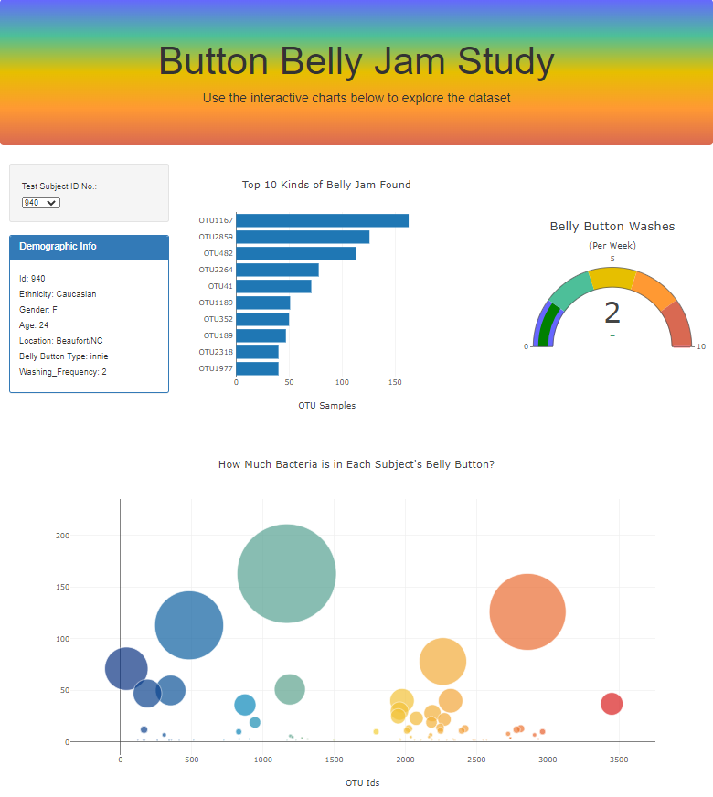

# OTUBacteriaAnalysis
OTUBacteriaAnalysis using JavaScript (HTML, Plotly, D3, APIs, JSON, Math, GitHub Deployment)

## Project Overview: 
This project was created by using belly button bacteria samples from 153 individuals. We extract all sample ids from samples.JSON and load them in a dropdown menu so that the user is able to select and view:

- the demographics of the subject
- a horizontal bar chart displaying the number of 'jams' (bacteria) in a person's belly 
- a gauge chart displaying the number of times a subject washed their belly button 
- a bubble chart displaying the OTU bacteria results

## Resulting Website:

